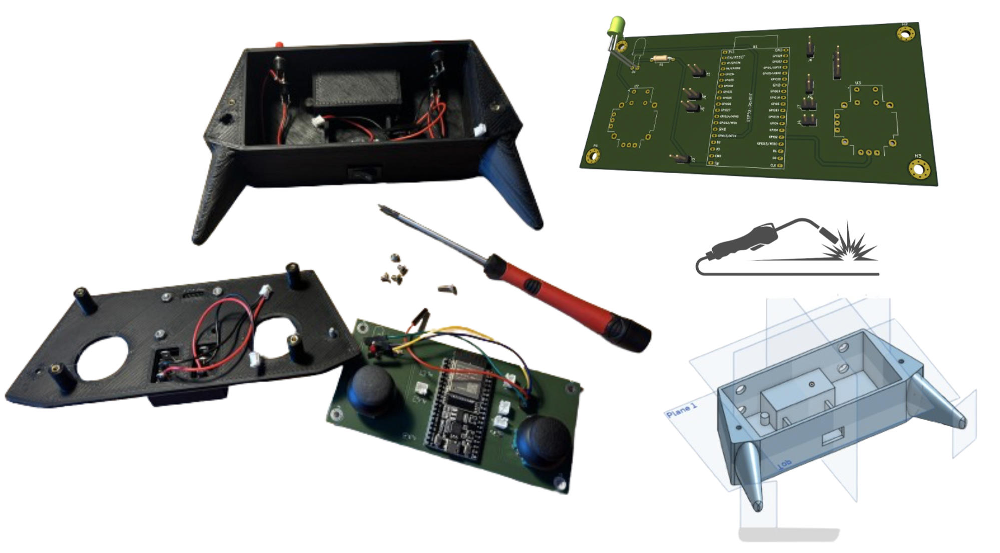

# _Assemblage_

Une fois les composants soudés sur la carte électronique imprimée, nous avons vérifié méticuleusement chaque connexion pour nous assurer qu'il n'y avait aucune erreur ou défaut. Cela inclut la vérification visuelle ainsi que l'utilisation d'outils de mesure pour tester la continuité et la résistance électrique à travers le circuit. Cette étape est essentielle pour garantir le bon fonctionnement du dispositif et éviter tout dysfonctionnement potentiel.

En parallèle, la conception du boîtier à l'aide de la modélisation 3D a été un processus itératif. Nous avons commencé par créer des modèles numériques en prenant en compte les dimensions des composants électroniques ainsi que les besoins ergonomiques et esthétiques. Ensuite, nous avons effectué des simulations pour évaluer l'ajustement et l'accessibilité des composants à l'intérieur du boîtier.

Une fois que le design du boîtier a été finalisé, nous avons utilisé des techniques de fabrication telles que l'impression 3D ou la découpe CNC pour produire le boîtier physique. Cette étape a demandé une attention particulière pour s'assurer que les dimensions et les tolérances étaient conformes au modèle numérique, garantissant ainsi un assemblage sans problème avec la carte électronique et les composants internes.

Après avoir intégré la carte électronique dans le boîtier, nous avons procédé à des tests fonctionnels approfondis pour évaluer les performances de la manette multi-usage. Cela inclut la vérification de toutes les fonctions et caractéristiques prévues, telles que la réactivité des boutons et des joysticks, ainsi que la connectivité avec d'autres dispositifs si nécessaire.

Une fois tous les tests réussis et les éventuels problèmes résolus, nous avons finalisé l'assemblage en fixant définitivement la carte électronique dans le boîtier et en assurant une fermeture sécurisée. Le prototype était alors prêt pour une évaluation finale et des démonstrations, démontrant ainsi la réussite de notre processus d'assemblage et la fonctionnalité de la manette multi-usage.

## _Illustration de l'assemblage de la manette multi-usage :_

## _Illustration du prototype final de la manette multi-usage :_

