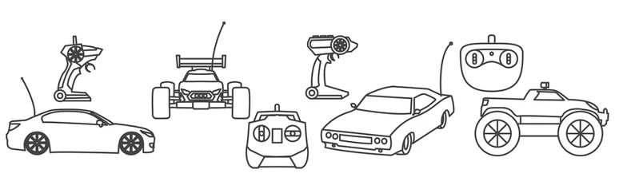
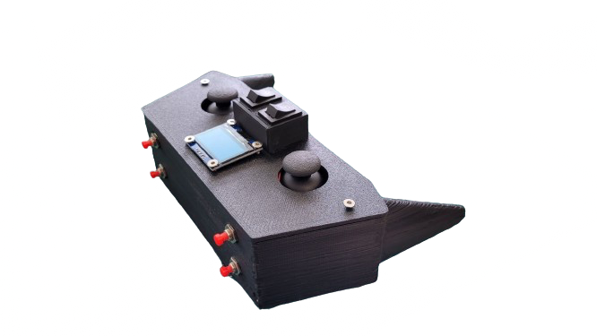
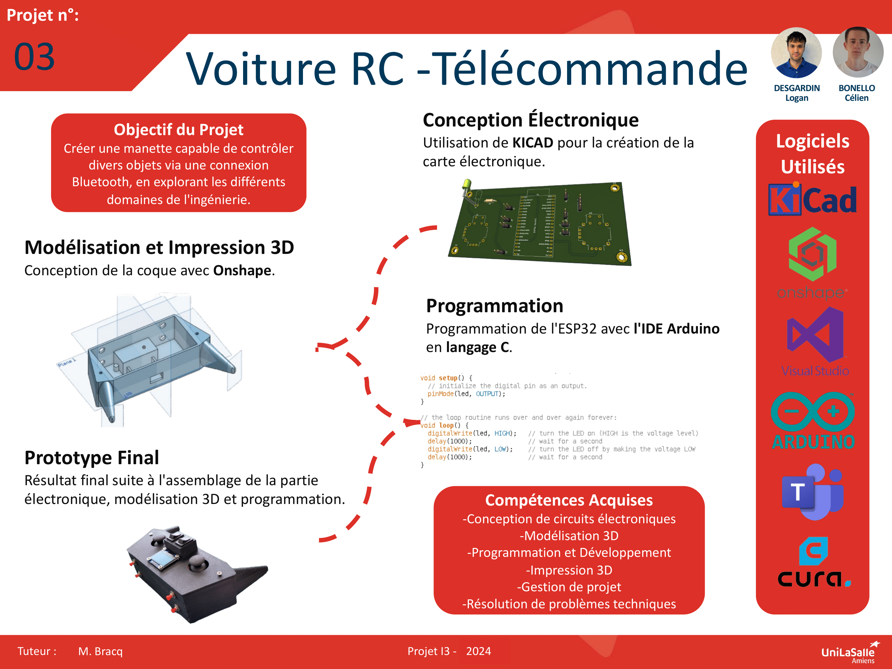

# Bienvenue dans la documentation de notre projet RC Remote

## _Résumé du projet_

Nous sommes deux étudiants en troisième année d'ingénierie à UniLaSalle Amiens. Dans le cadre de notre formation, nous avons conçu une manette multi-usage capable de contrôler différents appareils via Bluetooth avec un microcontrôleur ESP32.
Nous avons d'abord créé la carte électronique avec KICAD, puis soudé les composants et conçu la coque avec Onshape. Après avoir surmonté des difficultés d'impression 3D, nous avons assemblé la manette et entamé la programmation de l'ESP32 pour assurer une communication stable.
Ce projet nous a permis de renforcer nos compétences en électronique, modélisation 3D et programmation, tout en nous préparant aux défis techniques de l'ingénierie.

## _Mots clefs_

Ingénierie ; UniLaSalle Amiens ; Projet étudiant ; Manette multi-usage ; Bluetooth ; ESP32 ; Microcontrôleur ; KICAD ; Carte électronique ; Impression 3D ; Onshape ; Modélisation 3D ; Soudure de composants ; Conception électronique ; Programmation ; Communication sans fil ; Défis techniques ; Prototypage ; Collaboration ; Évaluation académique

## _Illustration du prototype</u>

Voici une illustration de notre manette multi-usage, développée dans le cadre de notre projet de troisième année.

## _Poster_

Voici notre affiche qui présente une vue d'ensemble de notre projet.

## _Vidéo_

Voici notre vidéo qui offre une présentation globale de notre projet.

<video src="images/video.mp4" controls title="Title"  style="width: 100%;"></video>

## _Remerciements_

Nous tenons à exprimer notre profonde gratitude à toutes les personnes et institutions qui ont contribué à la réalisation de ce projet. Sans leur soutien et leurs conseils, nous n'aurions pas pu mener à bien ce projet.

Tout d'abord, nous remercions chaleureusement nos professeurs et encadrants de UniLaSalle Amiens. Leur soutien constant, leurs conseils avisés et leur encadrement tout au long de ce projet ont été essentiels à notre réussite. En particulier, nous remercions Mr Bracq Adrien pour son expertise en électronique et ses conseils techniques précieux, ainsi que pour son aide en modélisation 3D et en programmation.

Nous souhaitons également exprimer notre reconnaissance au laboratoire d'électronique de UniLaSalle Amiens pour nous avoir fourni les ressources matérielles nécessaires. Les composants électroniques, les outils de soudure et les imprimantes 3D mis à notre disposition ont été indispensables pour la conception et la réalisation de notre manette multi-usage. Nous remercions en particulier Mr Chaumier Guy pour son assistance technique et ses conseils pratiques qui nous ont permis de surmonter de nombreux défis.

Un grand merci à nos camarades de classe pour leurs encouragements, leurs retours constructifs et leur soutien moral tout au long du projet. Leurs idées et suggestions ont enrichi notre réflexion et ont contribué à l'amélioration continue de notre travail. En particulier, nous remercions Mr Looij Dylan , Mr Bianchi Pierre-Alex pour leur aide dans la résolution des problèmes techniques rencontrés lors de l'impression 3D.

Nous tenons également à exprimer notre reconnaissance envers l'équipe administrative de UniLaSalle Amiens. Leur gestion logistique efficace, la mise à disposition des salles de travail et des équipements informatiques ont grandement facilité notre progression. 
Enfin, nous adressons nos plus sincères remerciements à nos familles et amis pour leur soutien inconditionnel, leur patience et leur compréhension tout au long de ce projet. Leur confiance en nous a été une source constante de motivation et d'inspiration. 

Grâce à l'aide et au soutien de chacun, nous avons pu mener à bien ce projet et en tirer de précieuses leçons pour notre future carrière d'ingénieur. Ce projet n'a pas seulement été une réussite académique, mais aussi une aventure humaine enrichissante qui nous a permis de développer des compétences techniques et interpersonnelles essentielles.

---
