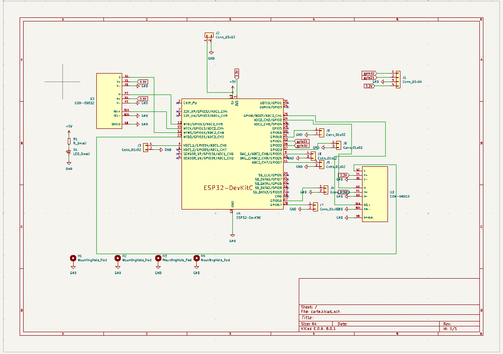
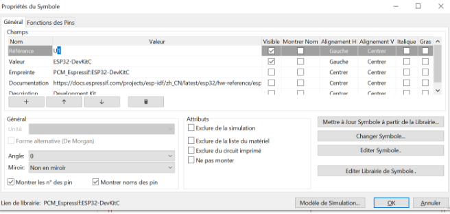
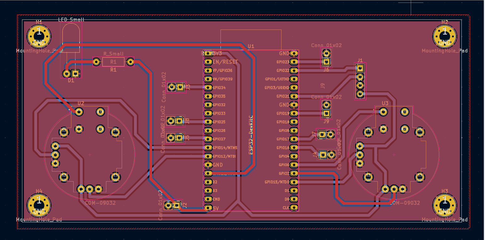
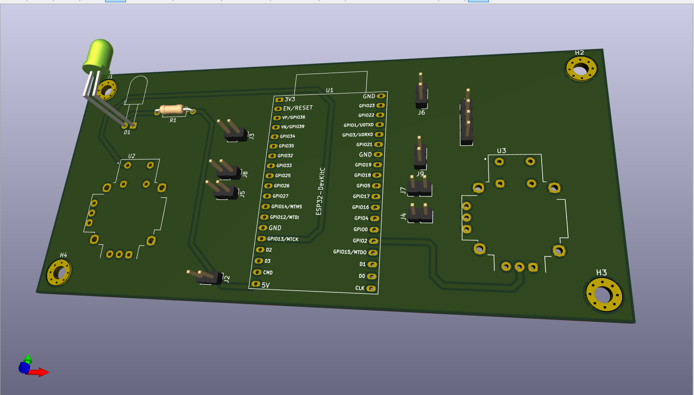
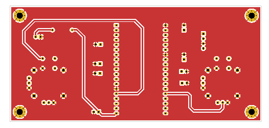
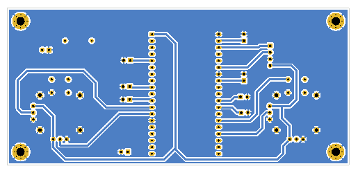

Après avoir utilisé Wokwi afin de définir les différentes fonctionnalités qui nous seront utiles et les pins que nous allons utiliser, nous passons à la création de la carte électronique. Pour ce faire, nous utilisons KiCad, un logiciel open source.

## _Éditeur de Schématique_

Pour commencer, nous utilisons l’éditeur de schématique afin de placer nos différents composants et de les connecter. Nous plaçons l'ESP32 de 38 broches en premier puisqu’il constitue la pièce principale. Nous utilisons ici un devkit afin de simplifier notre carte électronique, et nous avons choisi un modèle à 38 broches pour son pin 5V, qui nous permet une alimentation en 5V en plus du 3V3 présent sur les autres devkits. Nous choisissons d’utiliser des connecteurs pour les interrupteurs, l’écran et l’alimentation afin de simplifier l’assemblage futur. Nous avons dû importer les joysticks dans les librairies car ils n’étaient pas présents par défaut. Nous avons également ajouté une LED afin de servir de témoin lumineux pour l’alimentation.

Une fois tous nos composants placés, nous les relions aux pins correspondants décidés lors de l'utilisation de Wokwi. Pour cela, nous utilisons des fils et des labels.

## _Empreintes_

Une fois notre schématique terminée, nous devons attribuer des empreintes à chaque composant. Pour cela, nous utilisons la commande E. Dans le menu des empreintes, nous avons un large choix avec plusieurs empreintes pouvant correspondre à un même composant. Pour décider laquelle choisir, il faut se référer au composant que nous avons commandé. Si l’empreinte désirée ne se trouve pas dans la bibliothèque, il faut l’ajouter.

## _Éditeur de PCB kicad_

On passe à la phase 2. Ici, nous commençons par définir la forme et la taille de notre carte. Ensuite, nous plaçons les empreintes de façon optimale. Nous définissons une taille de gravure de 0,8 mm (c’est la taille utilisée par les industriels qui produisent nos cartes) pour pouvoir relier les composants. Pour relier les composants entre eux, nous devons faire attention à ce que les connexions ne se croisent pas. Pour cela, nous avons deux faces sur lesquelles nous pouvons tracer nos gravures. Nous relions seulement les pins connectés à la phase. Pour la masse, nous réalisons ce qu'on appelle un plan de masse, qui consiste à transformer le reste de notre carte (là où il n’y a pas de gravures) en masse. Pour l'éditer, nous utilisons la touche B.

## _Réglages_

Afin de vérifier notre carte, nous disposons de plusieurs solutions. Nous pouvons imprimer la carte sur papier pour vérifier la taille des trous pour les pins. Nous pouvons également visualiser la carte en 3D pour se rendre compte du résultat. Nous pouvons aussi l’imprimer en 3D afin de se rendre compte de sa corpulence réelle. Enfin, toutes ces fonctionnalités nous permettent de régler la place des composants et de choisir les empreintes afin de limiter les erreurs avant la production. Une fois terminé, nous pouvons envoyer notre fichier à l’industriel pour l’impression.

Page web réalisée par Célien BONELLO & Logan DESGARDIN , étudiants à UniLaSalle Amiens.
