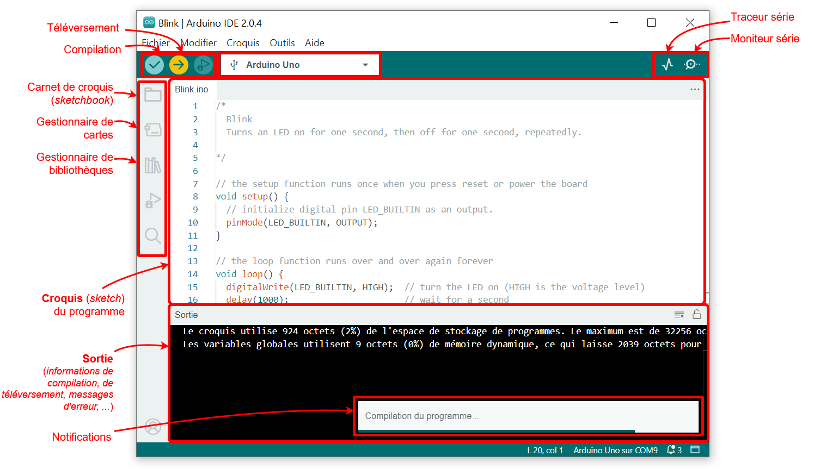

# <span style="color:#003366">_programmation_</span>

## <span style="color:#DB1702">_IDE Arduino_</span>

Pour programmer mon microprocesseur ESP32, j'ai opté pour l'utilisation de l'IDE Arduino. J'ai choisi cette application parce que je l'ai déjà utilisée auparavant et qu'elle est réputée pour sa simplicité d'utilisation. 

Pour vous expliquer globalement le processus, voici les étapes que j'ai suivies :

- _**Écriture du code**_ : J'ai rédigé mon code dans l'éditeur intégré de l'IDE Arduino, qui est spécifiquement conçu pour le développement de projets basés sur des microcontrôleurs comme l'ESP32.

- _**Compilation du code**_ : Une fois le code écrit, je l'ai compilé à l'aide de l'outil de compilation intégré. Cette étape est cruciale car elle permet de vérifier si le code comporte des erreurs de syntaxe ou de logique.

- _**Détection des erreurs**_ : Si des erreurs sont présentes dans le code, l'IDE Arduino fournit des messages d'erreur détaillés qui indiquent précisément où ces erreurs se trouvent. Cela permet de corriger rapidement les problèmes identifiés.

- _**Vérification avant l'injection**_ : L'un des avantages majeurs de l'IDE Arduino est qu'il permet de vérifier et de déboguer le code avant de l'injecter dans le microprocesseur ESP32. Cette étape de pré-injection garantit que le code fonctionnera comme prévu une fois transféré sur le matériel.



## <span style="color:#003366">_Explication du Fonctionnement du Code de la Manette Multi-Usage a l'aide d'un schéma bloc_</span>

Pour vous expliquer le fonctionnement de mon code, j'ai décidé de vous fournir une explication illustrée à l'aide d'un schéma en blocs. Ce schéma permettra de visualiser de manière claire et structurée le mécanisme de mon code, facilitant ainsi la compréhension de son fonctionnement global. 

Pour ceux qui sont plus à l'aise techniquement, j'ai également inclus, après le schéma en blocs, des extraits de mon code. Chaque extrait est accompagné d'explications détaillées pour décrire précisément le rôle de chaque segment de code, les logiques appliquées, et les interactions entre les différentes parties. 

Cette approche vous permettra de comprendre non seulement l'architecture générale du code, mais aussi les détails techniques qui le composent, rendant ainsi l'ensemble du processus transparent et accessible à différents niveaux de compétence.


## <span style="color:#DB1702">_Explication Détaillée du Fonctionnement du Code de la Manette Multi-Usage_</span>

Pour mieux comprendre le fonctionnement du code de notre manette multi-usage, nous allons approfondir chaque étape de la programmation en suivant les blocs décrits dans le schéma.

### 1. Lecture des Entrées

La première étape consiste à lire les données provenant des différents dispositifs d'entrée. Cela inclut deux joysticks, quatre boutons poussoirs, et deux boutons ON/OFF. Chaque type de dispositif d'entrée est géré différemment en fonction de son mode de fonctionnement (analogique pour les joysticks, numérique pour les boutons).

```cpp
// Déclaration des pins pour les entrées
const int pinJoystick1X = A0;
const int pinJoystick1Y = A1;
const int pinJoystick2X = A2;
const int pinJoystick2Y = A3;
const int pinButton1 = 2;
const int pinButton2 = 3;
const int pinButton3 = 4;
const int pinButton4 = 5;
const int pinOnOff1 = 6;
const int pinOnOff2 = 7;

// Variables pour stocker les valeurs lues
int joystick1X, joystick1Y, joystick2X, joystick2Y;
bool button1, button2, button3, button4, buttonOnOff1, buttonOnOff2;

void readInputs() {
    joystick1X = analogRead(pinJoystick1X);
    joystick1Y = analogRead(pinJoystick1Y);
    joystick2X = analogRead(pinJoystick2X);
    joystick2Y = analogRead(pinJoystick2Y);
    button1 = digitalRead(pinButton1);
    button2 = digitalRead(pinButton2);
    button3 = digitalRead(pinButton3);
    button4 = digitalRead(pinButton4);
    buttonOnOff1 = digitalRead(pinOnOff1);
    buttonOnOff2 = digitalRead(pinOnOff2);
}
```

### 2. Traitement des Données

Une fois les données lues, nous devons les traiter pour déterminer quelles actions effectuer. Cela peut inclure des calculs pour convertir les valeurs analogiques des joysticks en commandes de mouvement et interpréter les états des boutons pour déclencher des actions spécifiques.

```cpp
void processInputs() {
    // Traitement des joysticks
    if (joystick1X > threshold) {
        // Action correspondante au mouvement du joystick 1 vers la droite
    } else if (joystick1X < -threshold) {
        // Action correspondante au mouvement du joystick 1 vers la gauche
    }

    if (joystick1Y > threshold) {
        // Action correspondante au mouvement du joystick 1 vers le haut
    } else if (joystick1Y < -threshold) {
        // Action correspondante au mouvement du joystick 1 vers le bas
    }

    // Traitement similaire pour joystick 2
    if (joystick2X > threshold) {
        // Action correspondante au mouvement du joystick 2 vers la droite
    } else if (joystick2X < -threshold) {
        // Action correspondante au mouvement du joystick 2 vers la gauche
    }

    if (joystick2Y > threshold) {
        // Action correspondante au mouvement du joystick 2 vers le haut
    } else if (joystick2Y < -threshold) {
        // Action correspondante au mouvement du joystick 2 vers le bas
    }

    // Traitement des boutons poussoirs
    if (button1) {
        // Action pour le bouton poussoir 1
    }
    if (button2) {
        // Action pour le bouton poussoir 2
    }
    if (button3) {
        // Action pour le bouton poussoir 3
    }
    if (button4) {
        // Action pour le bouton poussoir 4
    }

    // Traitement des boutons ON/OFF
    if (buttonOnOff1) {
        // Action pour le bouton ON/OFF 1
    }
    if (buttonOnOff2) {
        // Action pour le bouton ON/OFF 2
    }
}
```

### 3. Commandes de Contrôle

Après avoir traité les données, nous devons envoyer les commandes appropriées aux dispositifs de sortie. Cela peut inclure l'envoi d'informations à un écran LCD pour affichage et la communication via WiFi ou Bluetooth.

```cpp
// Fonction pour envoyer des données à l'écran LCD
void updateLCD() {
    lcd.clear();
    lcd.setCursor(0, 0);
    lcd.print("Joystick 1 X: ");
    lcd.print(joystick1X);
    lcd.setCursor(0, 1);
    lcd.print("Joystick 1 Y: ");
    lcd.print(joystick1Y);
    // Affichage des autres valeurs si nécessaire
}

// Fonction pour envoyer des données via WiFi/Bluetooth
void sendData() {
    // Exemple de fonction de communication WiFi
    wifiSendData(joystick1X, joystick1Y, joystick2X, joystick2Y, button1, button2, button3, button4, buttonOnOff1, buttonOnOff2);
}

void sendCommands() {
    updateLCD();
    sendData();
}
```

### 4. Boucle Principale

La boucle principale du programme (la fonction `loop()` en Arduino) exécute en continu les étapes de lecture des entrées, de traitement des données et d'envoi des commandes.

```cpp
void setup() {
    // Initialisation des pins et des périphériques (LCD, WiFi, etc.)
    pinMode(pinJoystick1X, INPUT);
    pinMode(pinJoystick1Y, INPUT);
    pinMode(pinJoystick2X, INPUT);
    pinMode(pinJoystick2Y, INPUT);
    pinMode(pinButton1, INPUT_PULLUP);
    pinMode(pinButton2, INPUT_PULLUP);
    pinMode(pinButton3, INPUT_PULLUP);
    pinMode(pinButton4, INPUT_PULLUP);
    pinMode(pinOnOff1, INPUT_PULLUP);
    pinMode(pinOnOff2, INPUT_PULLUP);
    // Initialisation de l'écran LCD
    lcd.begin(16, 2);
    // Initialisation de la communication WiFi/Bluetooth
    wifiInit();
}

void loop() {
    // Lecture des entrées
    readInputs();
    
    // Traitement des données
    processInputs();
    
    // Envoi des commandes de contrôle
    sendCommands();
    
    // Petite pause pour éviter une surcharge du processeur
    delay(10);
}
```

### Conclusion

Le code de notre manette multi-usage est conçu pour être modulaire et extensible. Chaque étape de la boucle principale (lecture des entrées, traitement des données, envoi des commandes) est clairement définie et peut être ajustée ou étendue en fonction des besoins spécifiques du projet. Grâce à cette structure, notre manette peut être facilement adaptée à différentes applications, qu'il s'agisse de jeux, de contrôle de robots, ou d'autres systèmes interactifs.


Page web réalisée par Logan Desgardin, étudiant à UniLaSalle Amiens.
