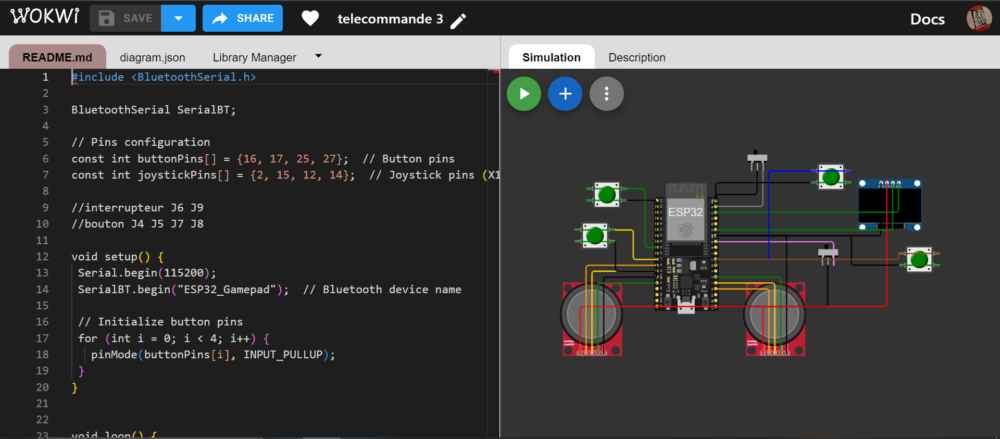

## _Qu'est-ce que Wokwi ?_

Wokwi est une plateforme en ligne dédiée à la simulation et à la prototypisation de projets électroniques. Elle permet aux utilisateurs de concevoir, de tester et de déboguer des circuits électroniques et des microcontrôleurs dans un environnement virtuel. Parmi ses fonctionnalités principales, on trouve :

- _**Simulation de Microcontrôleurs**_ : Wokwi prend en charge plusieurs types de microcontrôleurs, y compris l'ESP32, l'Arduino et le Raspberry Pi Pico.
- _**Bibliothèque de Composants**_ : La plateforme offre une vaste bibliothèque de composants électroniques tels que des capteurs, des afficheurs, des LED, des boutons, et bien d'autres, que les utilisateurs peuvent intégrer facilement dans leurs projets.
- _**Environnement de Codage**_ : Wokwi intègre un éditeur de code en ligne permettant de programmer directement les microcontrôleurs en utilisant des langages tels que le C/C++ pour Arduino ou le MicroPython pour d'autres dispositifs.
- _**Simulation en Temps Réel**_ : Les utilisateurs peuvent voir leurs circuits fonctionner en temps réel, ce qui facilite le débogage et l'optimisation du code et des circuits.

## _Pourquoi avons-nous utilisé Wokwi ?_

Nous avons choisi d'utiliser Wokwi pour plusieurs raisons stratégiques et pratiques dans le cadre de notre projet :

- _**Facilité de Prototypage**_ : Wokwi nous a permis de créer rapidement un prototype virtuel de notre manette, en testant différents composants et configurations sans avoir besoin de matériel physique. Cela a accéléré le processus de développement et nous a permis de tester plusieurs itérations de notre design.

- _**Économie de Temps et de Coûts**_ : En utilisant Wokwi, nous avons pu identifier et résoudre de nombreux problèmes de conception avant de passer à la phase de fabrication réelle. Cela a réduit les coûts liés aux erreurs matérielles et nous a fait gagner un temps précieux en évitant des allers-retours fréquents entre la conception et le test.

- _**Simulation Précise**_ : La capacité de Wokwi à simuler précisément le comportement des microcontrôleurs et des composants électroniques nous a permis de vérifier le bon fonctionnement de notre code et de nos circuits dans un environnement contrôlé. Nous avons pu tester les interactions entre le matériel et le logiciel de manière exhaustive.

- _**Collaboration et Partage**_ : Wokwi offre des fonctionnalités de partage de projets, facilitant la collaboration entre les membres de notre équipe. Chacun pouvait accéder au prototype virtuel, proposer des modifications et tester des idées de manière collaborative et efficace.

## _Ce que Wokwi nous a apporté_

L'utilisation de Wokwi a été un atout majeur pour notre projet, apportant plusieurs avantages :

- _**Prototypage Rapide et Itératif**_ : Nous avons pu concevoir et tester plusieurs versions de notre manette rapidement, en ajustant le design et le code en fonction des résultats obtenus dans l'environnement de simulation.
- _**Réduction des Risques**_ : En identifiant et en corrigeant les problèmes dès la phase de simulation, nous avons minimisé les risques d'erreurs coûteuses lors de la fabrication réelle.
- _**Optimisation du Design**_ : La possibilité de tester différentes configurations nous a permis d'optimiser le design de notre manette, tant au niveau matériel que logiciel, avant de finaliser le prototype physique.
- _**Apprentissage et Innovation**_ : L'utilisation de Wokwi nous a permis d'expérimenter avec des composants et des techniques que nous n'aurions peut-être pas envisagés autrement, favorisant ainsi l'innovation et l'apprentissage continu au sein de notre équipe.

En résumé, Wokwi a été un outil précieux qui a considérablement facilité le développement de notre projet, en nous offrant une plateforme robuste et flexible pour concevoir, tester et optimiser notre manette avant de procéder à sa réalisation physique.

## _Voici une illustration du Wokwi que nous avons réalisée :_

Page web réalisée par Logan DESGARDIN , étudiant à UniLaSalle Amiens.

